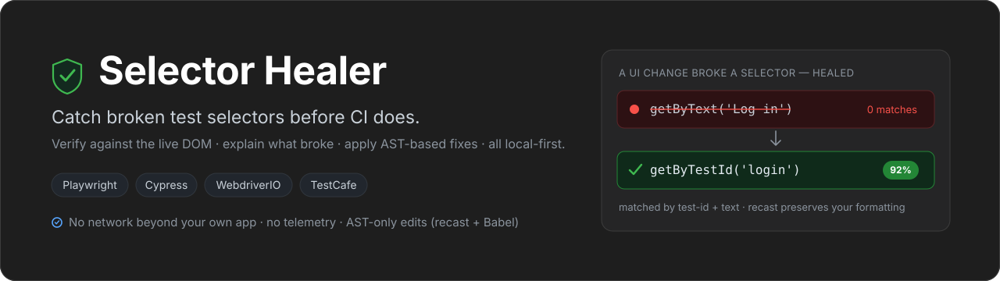

<div align="center">



&nbsp;

[](https://github.com/chiragx7/selector-healer/actions/workflows/ci.yml)
[](LICENSE)


**Catch broken test selectors before CI does** - for **Playwright, Cypress, WebdriverIO & TestCafe**.
Selector Healer verifies each selector against your live DOM, shows _why_ it broke, and applies
AST-based fixes - from the CLI or a local-first VS Code dashboard. Nothing leaves your machine.

</div>

---

- 🩹 **Heals broken selectors** - scores live-DOM candidates against a stored fingerprint and proposes ranked, explainable replacements.
- 🧠 **Learns from your choices** - remembers which kinds of fix you Apply vs Skip and gently nudges future suggestions toward your preference (bounded, fully local, and never enough to change an auto-apply).
- 📊 **Analytics dashboard** - a VS Code **Overview** with selector health, a robustness gauge, health-over-time, composition, and per-page breakdowns.
- ⚡ **Shift-left** - catches breakage at commit time (pre-commit or in your editor), not at 09:00 the next morning in CI.
- 🧭 **Near-zero config** - `init` auto-detects your framework, base URL, test directory, and even the login flow and pages.
- 🔒 **Local-first** - AST-only edits via recast + Babel (never regex on your source); no network beyond your own app, no telemetry.

## Quick start

```bash
# Install (pnpm via Corepack)
corepack pnpm install

# Initialize in your project - auto-detects framework, base URL, test dir, login + pages
npx selector-healer init

# Then:
npx selector-healer capture       # Baseline: fingerprint every selector against the live DOM
npx selector-healer verify        # Check for broken selectors + see healing suggestions
npx selector-healer verify --fix  # Auto-apply high-confidence fixes
npx selector-healer report        # Generate a self-contained HTML report
```

## How it works

1. **Parse** - walks the Babel AST of your test files (Playwright, Cypress, WebdriverIO, TestCafe) and extracts every selector call: `getByTestId()`, `getByRole()`, `page.locator()`, `cy.get()`, …
2. **Capture** - resolves each selector against the live DOM and stores a structural **fingerprint** (tag, attributes, text, parent chain, sibling index, page URL) in `.selector-healer/fingerprints.json` - committed to git, so the baseline travels with your code.
3. **Verify** - re-runs each selector against the current DOM: zero matches = broken, many = ambiguous.
4. **Heal** - for broken selectors, scores DOM candidates against the stored fingerprint with a **10-rule weighted engine** (data-testid, id, role, tag, text, class overlap, aria, parent structure, sibling position, attribute coverage) and returns up to three ranked suggestions - each with an inspectable per-rule confidence breakdown.

No LLM, no cloud - the scoring is a deterministic, inspectable engine that runs entirely on your machine.

## The VS Code experience

An **Overview** analytics home ties everything together: overall **selector health**, a live **baseline** (with one-click prune of stale fingerprints), a **robustness gauge**, **health-over-time**, selector **composition**, and a **per-page** breakdown - with persistent tabs to Results, Baseline, and Heal History.

<!-- Tip: drop a real screenshot here after an F5 pass, e.g.
<div align="center"></div>
-->

- **Explainable, previewable heals** - _why_ it broke, all ranked candidates side by side, a **"Why NN%?"** per-rule breakdown, and a **diff preview** before you Apply.
- **Learns from accept/reject** - the more you Apply or Skip, the better your suggestions get ranked, each with a **"✨ you usually accept X fixes"** note. Feedback stays local (or, opt-in, shared with your team) - no network, ever.
- **Watch mode** - auto re-verify a test file the moment you save it.
- **Skip** a broken selector to silence it everywhere (list, health, "Heal all", _and_ the editor squiggles/gutter/CodeLens) - restorable, and it returns when you edit the selector.
- **Heal History + one-click Undo** - every applied fix is reversible.
- **Editor integration** - Quick Fixes (`Ctrl+.`), per-selector CodeLens, hover cards, gutter dots + Problems diagnostics, and proactive **fragility lint** for brittle locators.
- **Onboarding** - a built-in **Get Started** walkthrough and a Settings UI.

See the [extension README](packages/vscode-extension/README.md) for the full tour.

## Packages

| Package | Description |
|---|---|
| [`@selector-healer/core`](packages/core) | Framework-agnostic library: parser, fingerprint, verifier, healer. |
| [`@selector-healer/cli`](packages/cli) | `selector-healer` CLI binary for the terminal and CI. |
| [`vscode-extension`](packages/vscode-extension) | VS Code extension: dashboard, diagnostics, code actions, hover, status bar. |

## CLI commands

| Command | Description |
|---|---|
| `selector-healer init` | Detect framework, base URL, test dir, login + pages; write a ready-to-use config |
| `selector-healer capture` | Parse test files and capture DOM fingerprints |
| `selector-healer verify` | Verify selectors against the live DOM, show healing suggestions |
| `selector-healer verify --fix` | Auto-apply suggestions above the auto-apply threshold |
| `selector-healer prune` | Remove baseline fingerprints for selectors that no longer exist (`--dry-run` to preview) |
| `selector-healer report` | Generate a self-contained HTML report |

**Options:** `-v, --verbose` (per-selector detail) · `--fail-on-warning` (exit 1 on ambiguous matches) · `-o, --output <path>` (report path).

## Configuration

Run `selector-healer init` to generate a config automatically - it detects your framework, base URL, test directory, and login flow. Or write `selector-healer.config.ts` by hand:

```typescript
import type { HealerConfig } from '@selector-healer/core';

export default {
  testDir: './tests',
  baseUrl: 'http://localhost:3000',
  headless: true,
  timeout: 30_000,
} satisfies HealerConfig;
```

| Option | Type | Default | Description |
|---|---|---|---|
| `testDir` | `string` | required | Directory containing your test files |
| `baseUrl` | `string` | required | Base URL of the app under test |
| `testGlob` | `string` | `**/*.{spec,test}.{ts,tsx,js,jsx}` | Glob for test-file discovery |
| `framework` | `'playwright' \| 'cypress' \| 'webdriverio' \| 'testcafe'` | auto-detected | Test framework for parsing + heal output |
| `browser` | `'chromium' \| 'firefox' \| 'webkit'` | `'chromium'` | Browser used to drive the live DOM |
| `headless` | `boolean` | `true` | Run the browser headlessly |
| `timeout` | `number` | `30000` | Page-load timeout (ms) |
| `confidenceThreshold.autoApply` | `number` | `0.8` | Min confidence for `--fix` / "Apply All" |
| `confidenceThreshold.suggest` | `number` | `0.2` | Min confidence to show a suggestion |
| `globalSetup` | `(context) => Promise<void>` | - | Pre-verification hook for auth/cookies |

## CI integration

```yaml
- name: Verify selectors
  run: npx selector-healer verify --fail-on-warning
```

Or as a pre-commit hook:

```bash
npx selector-healer verify
```

## Local development

Requires **Node 20+**; pnpm comes via Corepack.

```bash
corepack pnpm install     # Install all workspaces
corepack pnpm build       # Build every package
corepack pnpm test        # Run all test suites
corepack pnpm lint        # Biome check (lint + format)

corepack pnpm -F @selector-healer/core test   # A single package
corepack pnpm -F @selector-healer/cli dev      # CLI in watch mode
```

See [`docs/DECISIONS.md`](docs/DECISIONS.md) for the rationale behind non-obvious design choices.

## License

[MIT](LICENSE)
